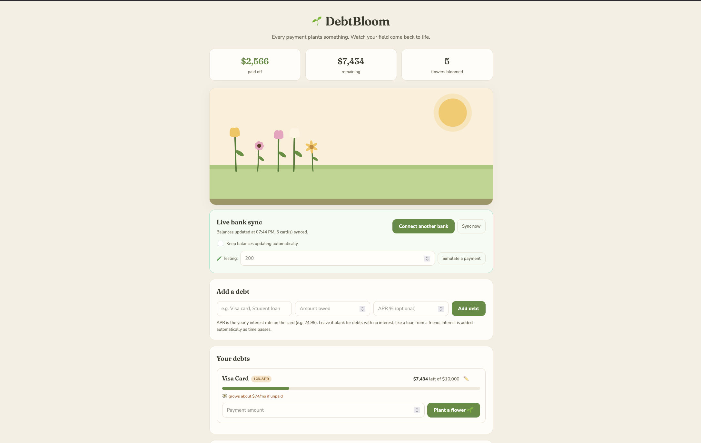

# DebtBloom

**Debt payoff you can actually see.** Every payment plants a flower. Pay down a real credit card, and the garden blooms on its own.

<!-- TODO: swap in your screenshot -->


<!-- TODO: paste your demo link, or delete this line -->
**[Watch a 90-second demo](https://www.loom.com/share/64a021ecf7c644198f9c3cffc42903c7?t=10)**

---

## Why I built this

I was 19 when I lost my father. 

What nobody warns you about is how much of grief is paperwork. The mortgage did not care. Neither did the tuition, or the car, or the interest quietly compounding on all three. So I signed for loans, and for a long stretch it felt like the whole thing was one bad month away from coming down.

I knew what I owed. I checked constantly — that was the problem. Every app I had was a spreadsheet with better fonts, and spreadsheets are honest in the least useful way: they will tell you your balance to the cent, forever, and never once tell you whether any of it is working. Is this number going down because of me, or in spite of me? Does the fifty dollars I didn't spend tonight matter, or did I just skip dinner for nothing?

DebtBloom is the answer to those two questions. The garden answers the first — you can see the work. The time machine answers the second: drag a slider and that fifty dollars becomes *nineteen months sooner, $1,174 less interest*.

I studied psychology, not computer science. I had never written a line of code before this. I built it because I wanted it to exist, and because nineteen-year-old me could have used it.

---

## What it does

**A garden that grows with you.** Every payment plants a procedurally generated flower — random petals, colors, heights, species. No two are alike, because no two payments are.

**Interest that behaves like interest.** Balances compound daily against each debt's APR, the way real cards do. Leave $1,000 alone at 24.99% and watch it quietly become $1,021.

**A payoff time machine.** Drag a slider, add extra to your monthly payment, and see the trade instantly: months off your timeline, dollars saved. It simulates the payoff month by month, paying down the highest-APR debt first — the avalanche method.

**Goals with pacing.** "Half my debt within a year" is two clicks. The app tells you if you're **on pace**, **behind**, or **done**, and what it costs per month to stay honest.

**Achievements.** Eight medals for milestones that actually mean something — first flower, first debt cleared, halfway, debt-free.

**Live bank sync.** Connect a bank through Plaid and real balances flow in with their APRs. When a balance drops, the app reads it as a payment and blooms the garden by itself. No data entry, no lying to yourself.

**Full control.** Names, balances, and APRs change. So you can edit them.

---

## How it works

```
Browser (public/index.html)  ←→  Node/Express server (server.js)  ←→  Plaid API
```

The Plaid key stays in a `.env` file the browser never sees, and the bank login goes straight to Plaid's own window — never through this app.

- `public/index.html` — the whole frontend: garden, interest, goals, medals, time machine
- `server.js` — Express server, and the only place the Plaid secret lives
- `.env` — private keys, gitignored, never committed

**Stack:** vanilla JavaScript, hand-generated SVG flowers, Node, Express, Plaid. No frameworks. I wanted to understand every line, and I do.

---

## Run it yourself

You'll need [Node.js](https://nodejs.org) and a free [Plaid account](https://dashboard.plaid.com/signup).

**1. Get your Sandbox keys.** Free and instant at [dashboard.plaid.com/developers/keys](https://dashboard.plaid.com/developers/keys). Sandbox runs on fake banks — no real accounts, no real money.

**2. Create your `.env` file.**

```bash
cp .env.example .env
```

Open the new `.env` and paste in your `client_id` and Sandbox secret. It's gitignored, so it stays on your machine.

**3. Install and start.**

```bash
npm install
npm start
```

**4. Open [http://localhost:8080](http://localhost:8080).** Through the server, not by double-clicking the HTML — sync needs the server running.

**5. Connect a test bank.** Click **Connect bank** and sign in with Plaid's Sandbox credentials: `user_good` / `pass_good` / `1234`. Fake banks, fake money, real code.

---

## Decisions worth explaining

**Four numbers, not one subtraction.** Every debt tracks its original amount, current balance, total paid, and total interest separately. The obvious approach — paid equals start minus balance — collapses the moment interest exists, because interest pushes the balance *up*. Do it that way and the person paying faithfully every month watches their progress bar go backwards. Money in and money out are different stories; the app tells both.

**Goals measure effort, not totals.** Each goal remembers what you'd paid the day you set it and counts only forward. Otherwise interest makes a goal you're winning look like a goal you're losing.

**The simulation has a cap.** The projection loops month by month, so a payment too small to cover interest would loop until the heat death of the universe. It stops at 1,200 months and tells you the truth instead: you're only paying the interest.

**Synced debts skip local interest.** Plaid reports the real balance, which already includes what the bank charged. Simulating it again would be charging you twice for the same sin.

---

## What I'd do differently

**Design the data before designing the features.** I added interest after payments already worked, which meant going back and rewriting how every debt is tracked. An hour of thinking would have saved a day of surgery.

**One bug taught me more than any feature did.** My "reset everything" function rebuilt the app's state and forgot two fields. Those fields became `undefined`, the next render crashed on them, and the crash took out goals, achievements, and the garden together. Three bugs that were one bug. The fix was a single line. The lesson was bigger: don't trust that every code path is perfect — make the app repair itself when one isn't.

**Real-time is a spectrum, and I'd rather say so.** This refreshes on load, on demand, and every sixty seconds. True push updates need Plaid webhooks and a public URL; the receiver is written, not wired. In fairness, card balances change when transactions post, not second to second — so polling catches everything that matters. But "real-time" is doing some work in that sentence, and you should know it.

**The projection compounds monthly while live balances compound daily.** That's the standard convention for payoff calculators and it keeps things fast. It also means the date is a very good estimate, not a promise.

---

## Roadmap

- Push updates via Plaid webhooks
- Snowball vs. avalanche, side by side
- Shareable garden snapshots — the picture, never the numbers
- A budget view wired into goal pacing

---

Debt doesn't get paid off in a day. It gets paid off on a Tuesday, and then another Tuesday, and then one more after that. The least a tool can do is show you the flowers.

*Built with Claude as a pair programmer, by someone who had never written code before.*
